<div align="center">

# ✨ CapperWeb

### The web console for [Capper](https://github.com/rickcollette/Capper) — a self-hosted, multi-tenant cloud control plane

*A dark, enterprise control-plane UI for compute, networking, storage, identity, topology, serverless, and observability —*
*served straight from the Capper binary, talking to the same `/api/v1` as the CLI and SDK.*


</div>

---

> [!NOTE]
> CapperWeb is the **Web UI** interface of [Capper](https://github.com/rickcollette/Capper) —
> one of four interfaces (CLI · REST API · Go SDK · Web UI) over the same control plane.
> It is a pure client: every action it takes is an authenticated call to `/api/v1`.

CapperWeb is a single-page React app that feels like a lightweight private AWS console
for capsules: instances, images, networks, VPCs, storage, IAM, topology, serverless,
certificates, and observability — all sitting on top of the Capper controller instead
of duplicating logic in the browser. In production it ships as static assets served
directly by `capper api start --console ./dist`.

## 🏗️ Where it fits

```mermaid
flowchart LR
    BROWSER["🖥️ Browser<br/>CapperWeb SPA"]

    subgraph SERVE["📦 Static assets"]
        DEV["⚡ Vite dev server<br/>:5173 (proxies /api/v1)"]
        PROD["🚀 capper api --console ./dist"]
    end

    subgraph CAPPER["🧠 Capper control plane"]
        API["🌐 REST API<br/><code>/api/v1</code>"]
        CORE["Controller · Auth · Scheduler"]
        STORE[("🗄️ SQLite / CapDB")]
    end

    BROWSER --> SERVE
    SERVE -. "/api/v1" .-> API
    API --> CORE --> STORE

    classDef ui   fill:#61DAFB,stroke:#0E7490,color:#04221A,stroke-width:2px;
    classDef serve fill:#6366F1,stroke:#312E81,color:#fff,stroke-width:2px;
    classDef core fill:#F59E0B,stroke:#92400E,color:#1F2937,stroke-width:2px;
    classDef data fill:#3B82F6,stroke:#1E3A8A,color:#fff,stroke-width:2px;

    class BROWSER ui;
    class DEV,PROD serve;
    class API,CORE core;
    class STORE data;
    style CAPPER fill:#FEF3C7,stroke:#F59E0B,stroke-width:3px,color:#1F2937;
    style SERVE fill:#E0E7FF,stroke:#6366F1,stroke-width:3px,color:#312E81;
```



## 🧭 Console map

Every Capper subsystem has a dedicated surface in the sidebar:

| Section | Pages |
|---|---|
| ⚙️ **Compute** | Instances, Images, Capsules, Instance Types, GPU, Compute Groups, Factory, Marketplace |
| 🌐 **Network** | Networks, VPCs, Load Balancers, Firewalls, DNS, Ingress, Routable IPs, Health |
| 💾 **Storage** | Block storage, Databases, Backups |
| 🧩 **Platform** | Stacks, CapInit, Queues, AI, Certificates · ACME · Renewals, KMS, Secrets, Posture, Governance |
| 🏢 **Organization** | Organizations, Audit Logs |
| 🗺️ **Topology** | Nodes & Zones, Nodes, Node Pools, Service Roles, Placement Simulator |
| 🔐 **IAM** | Users, Groups, Roles, Policies, Simulate, Tokens, Audit |
| λ **Serverless** | Functions, MCP Servers |
| 📊 **Observability** | Resources, Alerts |
| 🛠️ **System** | Quotas, Settings |

## ⚡ Quick start

<details open>
<summary><b>Local development</b></summary>

**Terminal 1** — start the Capper API:

```bash
cd ../Capper
go run ./cmd/capper api start --listen 127.0.0.1:8686 --with-daemon
```

**Terminal 2** — start the Vite dev server (proxies `/api/v1` → the API):

```bash
npm install
npm run dev
```

Open <http://localhost:5173>.

</details>

<details>
<summary><b>Production build</b></summary>

```bash
npm run build          # tsc -b && vite build → ./dist
```

Then serve the static assets straight from the Capper binary:

```bash
capper api start --listen 0.0.0.0:8686 --console ./dist
```

</details>

<details>
<summary><b>Tests &amp; lint</b></summary>

```bash
npm run lint           # ESLint
npm test               # Playwright e2e (expects the API on :8687)
npm run test:report    # open the last Playwright HTML report
```

</details>

## 🎚️ Build profiles

The console ships in two build-time profiles, selected with `VITE_PROFILE`:

| Profile | Use | Effect |
|---|---|---|
| `full` *(default)* | Complete multi-node control plane | All features visible |
| `aio` | Single-node all-in-one | Hides cluster-only surfaces (Topology, VPCs, Compute Groups + Factory, Organizations, Governance, Marketplace) so the UI never offers actions with no backing service |

Disabled features are removed from the nav and their routes redirect to `/`.

## ⚙️ Environment

| Variable | Default | Description |
|---|---|---|
| `VITE_CAPPER_API_URL` | `/api/v1` | API base URL |
| `VITE_FACTORY_URL` | `http://127.0.0.1:8080` | External CapsuleBuilder factory web UI |
| `VITE_MARKETPLACE_ENABLED` | `false` | Enable marketplace nav + pages |
| `VITE_PROFILE` | `full` | Deployment profile (`full` \| `aio`) |
| `VITE_CAPPER_VERSION` | `dev` | Build-stamped console version, matching the binaries |

## 🧱 Stack

**React 19** · **Vite 8** · **TypeScript** · **React Router 7** · **TanStack Query** ·
**Zustand** · **Tailwind CSS 4** · **Lucide** · **Monaco Editor** · **xterm.js** ·
**Recharts** · **Playwright**.

<div align="center">

---

*Built with React ⚛️ + Vite ⚡ — the web face of Capper 🚀, served from a single binary.*

</div>
